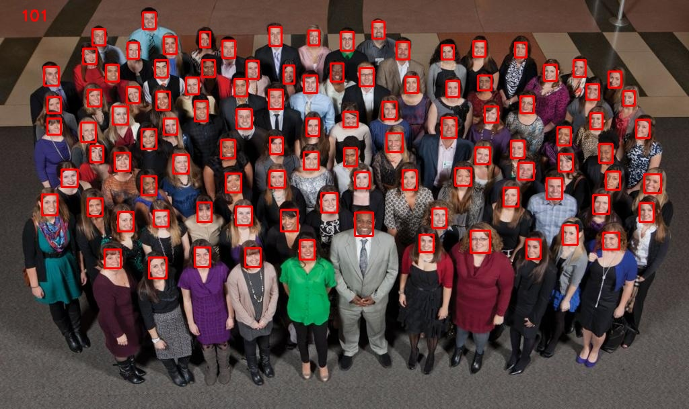
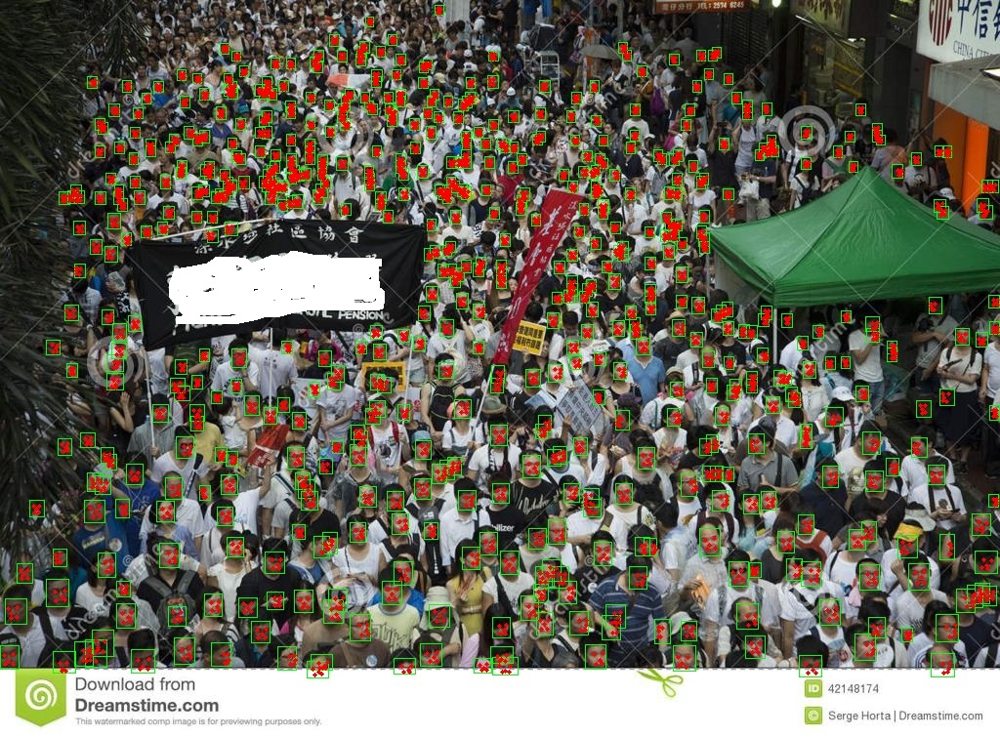
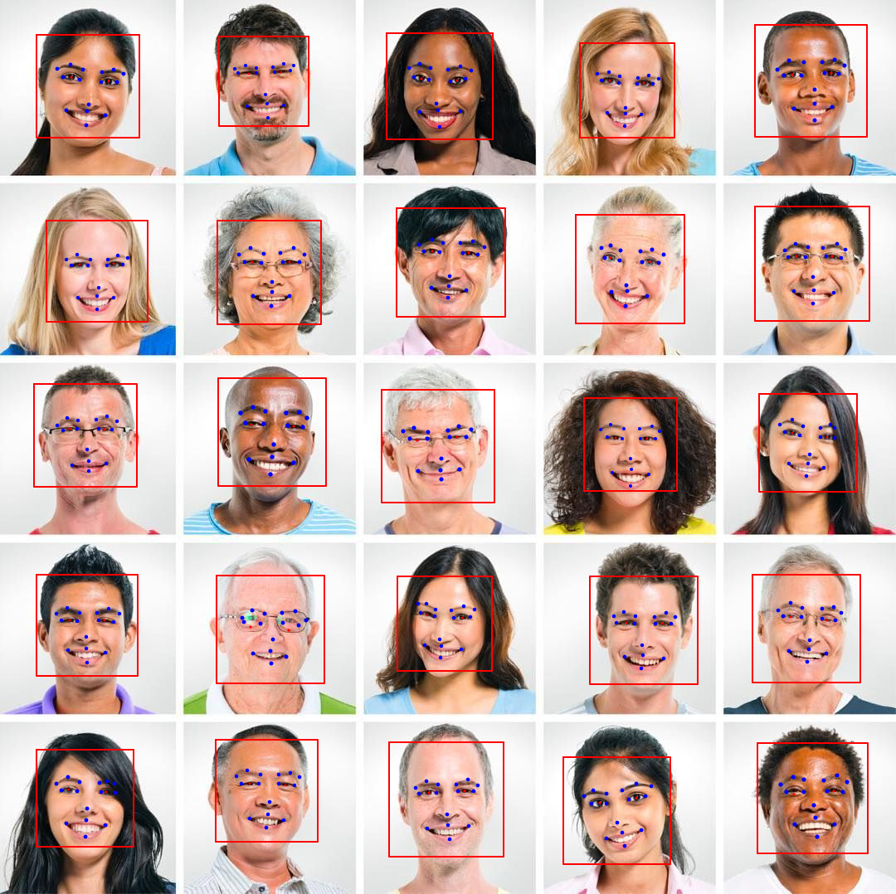
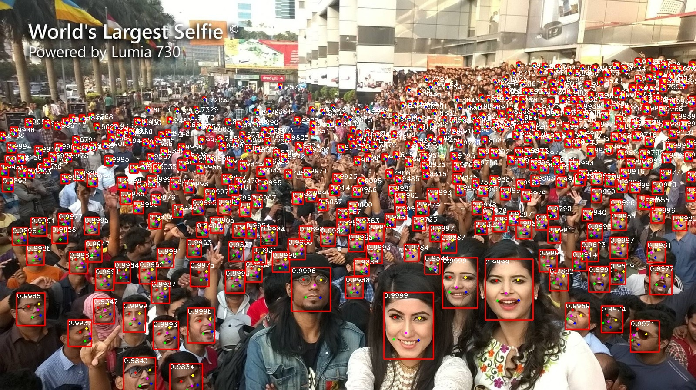
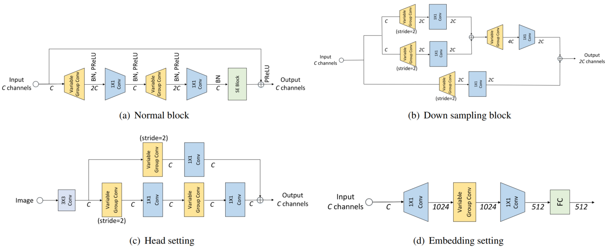
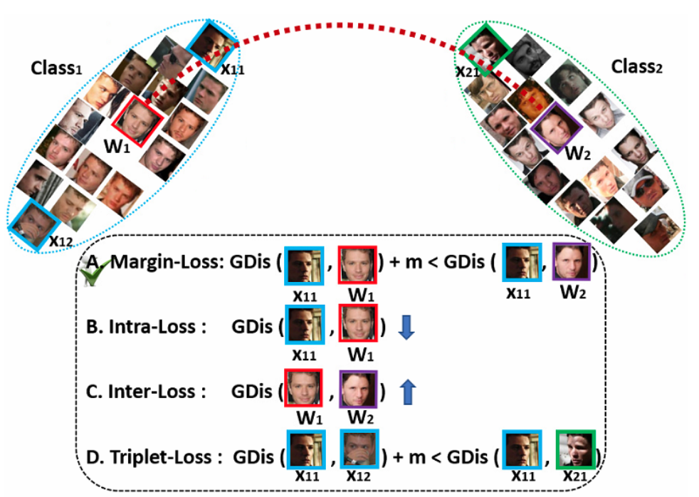
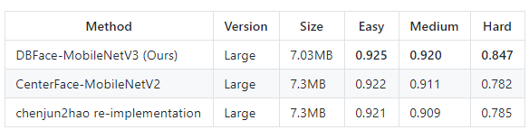

**1、 轻量级人脸检测模型**

Ultra-Light-Fast-Generic-Face-Detector-1MB

- https://github.com/Linzaer/Ultra-Light-Fast-Generic-Face-Detector-1MB

**2、CenterFace**

CenterFace(size of 7.3MB) is a practical anchor-free face detection and alignment method for edge devices.

- https://github.com/Star-Clouds/centerface

**3、Pigo**

Pigo is a pure Go face detection library based on Pixel Intensity Comparison-based Object detection paper

- https://github.com/esimov/pigo

**4、MaskInsightface**

改进地方：ssh(人脸检测)+prnet(68 landmark 人脸对齐， 3d人脸mask)+insightface

- https://github.com/bleakie/MaskInsightface

**5、使用mtcnn和o网络跟踪+光流跟踪进行多目标人脸跟踪，单目标人脸光流跟踪是0.5ms左右**

- https://github.com/xiangdeyizhang/FaceTrack_ncnn_HyperFT

**6、1M人脸检测模型(含关键点)**

- https://github.com/biubug6/Face-Detector-1MB-with-landmark

**7、VarGFaceNet**

This is a MXNET implementation of VarGFaceNet. We achieved 1st place at Light-weight Face Recognition challenge/workshop on ICCV 2019(deepglint-light track)

- https://github.com/zma-c-137/VarGFaceNet

**8、人脸检测算法PyramidBox++**

- https://zhuanlan.zhihu.com/p/63216442

**9、实时人脸识别检测器，用CPU达到 30FPS**

- https://github.com/markson14/Face-Recognition-Cpp

**10、基于级联卷积神经网络的人脸特征点定位**

- https://blog.csdn.net/hjimce/article/details/49955149

**11、人脸特征点标注工具**

- https://github.com/luigivieira/Facial-Landmarks-Annotation-Tool

**12、ArcFace: Additive Angular Margin Loss for Deep Face Recognition**

 **强判别能力的深度人脸识别**

- https://arxiv.org/pdf/1801.07698.pdf
- https://github.com/deepinsight/insightface/tree/master/recognition
- https://mp.weixin.qq.com/s/bAf5x1OOf8xqcQyMdTlWyg

**13、人脸识别数据集汇总**

- https://mp.weixin.qq.com/s/S4pVjQEutDJHitOnh55x0A

**14、极速人脸检测库libfacedetection**

- https://github.com/ShiqiYu/libfacedetection

**15、deepface：轻量人脸分析框架**

- https://github.com/serengil/deepface

**16、Face_benchmark**

- https://zhuanlan.zhihu.com/p/113565294

**17、DBFace：人脸检测实时快速单级检测器**

- https://github.com/dlunion/DBFace

**汇总：**

- https://github.com/search?q=face+detection
- https://github.com/search?q=face+recognition
- https://github.com/search?q=face&type=